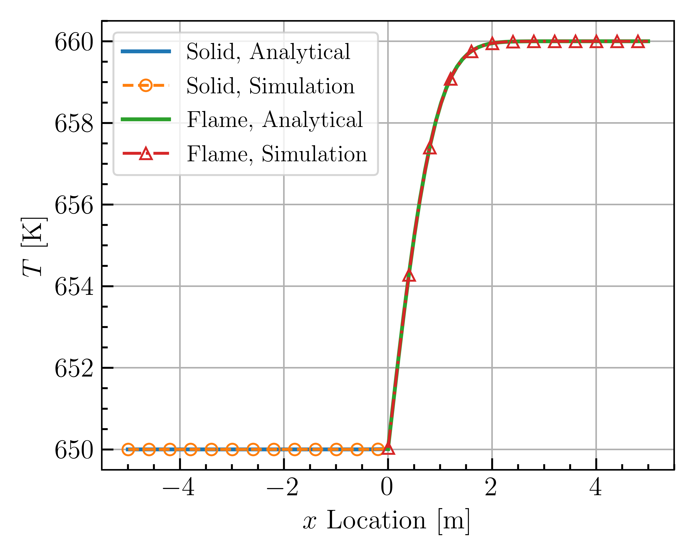

# Infinitely Fast Flame
julian.toumey@uconn.edu

_Oct 2020_

* Application: `chtMultiRegionFoam`
* CERFACS infinitely fast flame case
* Both the solid and the fluid (flame) are approximated as solid regions

---
**Results**

Good agreement is shown with the analytical solution: 

